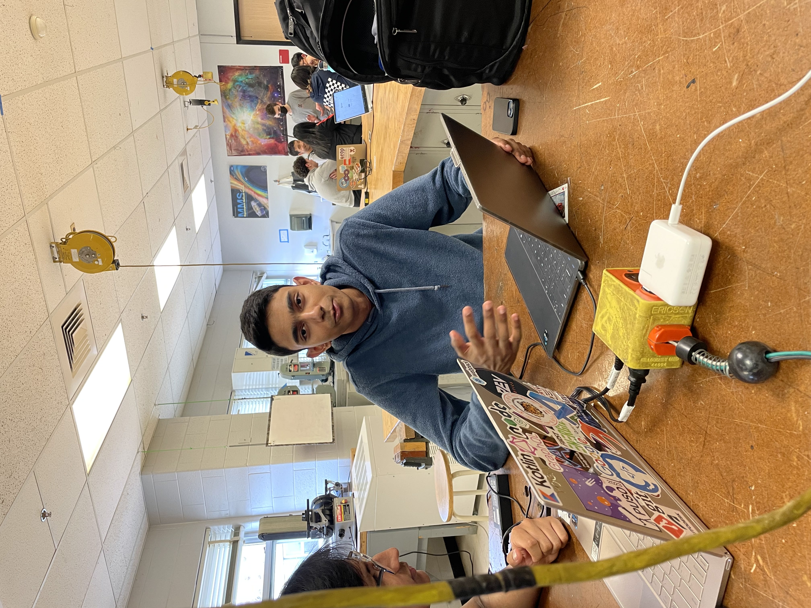

# Robot 2024

Repository for FRC team 449's code for the 2024 FRC Crescendo game.

## Workflows

--- 

There are currently three workflows, `run-tests.yml` to run tests, `ktlint.yml` to check formatting, and `gen-docs.yml` to generate documentation. Here is how `gen-docs.yml` works:

- It's triggered whenever you push to `main`
- It runs `./gradlew dokkaHtml` to generate HTML from all our doc comments
- The generated HTML is uploaded and deployed to GitHub Pages
- The documentation is accessible at https://blair-robot-project.github.io/robot2024/.

## John Joseph

---

John Joseph is team 449's head programmer. He often says goofy things.
> It worked in sim.  
> -- <cite>John Joseph</cite>

